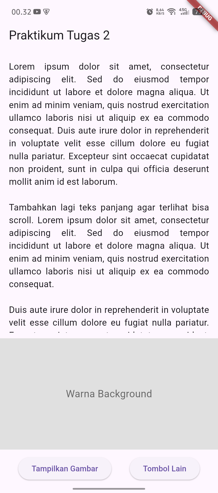
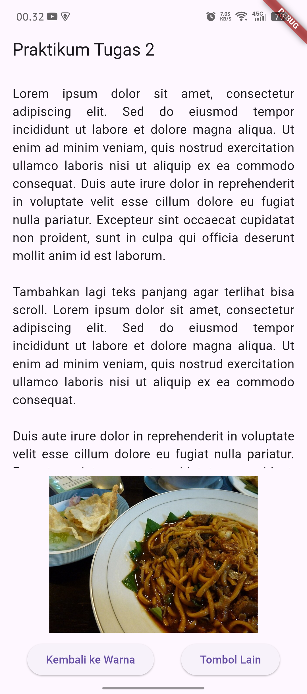
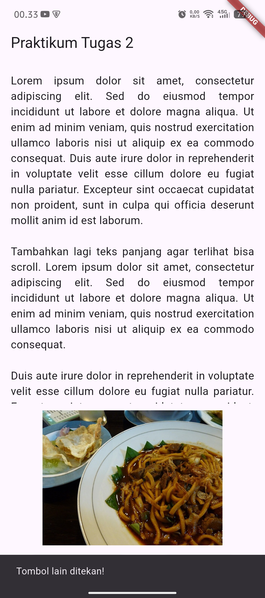

# belajar_flutter_iqbal

**Tugas 2 — Praktikum Flutter: Scroll, Layout, dan Event Gambar Dinamis**
Mata Kuliah **Pemrograman Mobile** — Universitas Syiah Kuala

| | |
|---|---|
| **Nama** | M. Iqbal Afdhalas |
| **NPM** | 2308001010015 |

---

## Deskripsi
Aplikasi Flutter sederhana satu halaman yang mendemonstrasikan tiga konsep dasar:

1. **Scroll** — teks panjang yang dapat digulir menggunakan `Expanded` + `SingleChildScrollView`.
2. **Layout** — dua tombol disusun horizontal menggunakan `Row` + `ElevatedButton`.
3. **Event Gambar Dinamis** — menampilkan/menyembunyikan gambar khas daerah (Mie Aceh)
   menggunakan *state* `_showImage` yang diubah lewat `setState()`.

## Fitur
- Teks panjang (lorem ipsum) bisa di-scroll dari atas ke bawah.
- Tombol **"Tampilkan Gambar"** → mengubah area abu-abu *"Warna Background"* menjadi foto
  **Mie Aceh** (toggle bolak-balik).
- Tombol **"Tombol Lain"** → menampilkan `SnackBar` bertuliskan *"Tombol lain ditekan!"*.

## Hasil Running Aplikasi
Dijalankan di perangkat Android (HP fisik):

<table>
  <tr>
    <td align="center"><b>1. Tampilan Awal<br>(Warna Background)</b><br></td>
    <td align="center"><b>2. Setelah "Tampilkan Gambar"<br>(Mie Aceh tampil)</b><br></td>
    <td align="center"><b>3. Tombol "Tombol Lain"<br>(SnackBar muncul)</b><br></td>
  </tr>
</table>

## Penjelasan Singkat Kode (`lib/main.dart`)
- **`Expanded` + `SingleChildScrollView` + `Text`** → membuat teks panjang dapat digulir tanpa
  melebihi layar (`textAlign: TextAlign.justify`).
- **`Container` (tinggi 200)** → menampilkan warna abu-abu bila `_showImage == false`, atau
  `Image.asset('assets/khas_daerah.jpg')` bila `_showImage == true`.
- **`Row` + `MainAxisAlignment.spaceEvenly` + 2 `ElevatedButton`** → menata tombol berdampingan
  secara merata.
- **`setState()`** → memberi tahu Flutter agar membangun ulang UI saat nilai `_showImage` berubah.

## Cara Menjalankan
```bash
flutter pub get
flutter run
```

## Kredit Gambar
Foto *"Mie Aceh with beef"* oleh **Yasmina Haryono**, lisensi **CC BY-SA 2.0**, via Wikimedia Commons.
Sumber: https://commons.wikimedia.org/wiki/File:Mie_Aceh_with_beef.jpg
